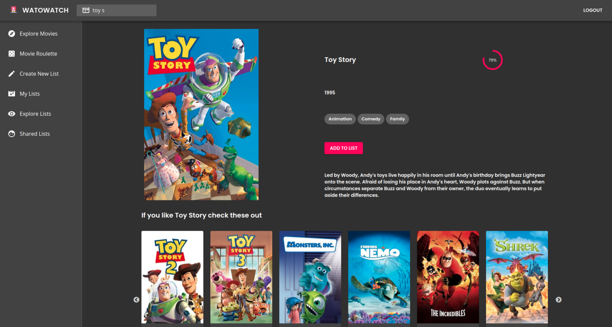

# Watowatch :movie_camera:

Watowatch is a movie list aggregation application, built using React, PostgreSQL, Express and Node. Create your own personal movie list and allow other users to edit them.

## Screenshots

## Installation :file_folder:

### Requirements

- PostgreSQL 12.4^
- API KEY from [TMDB](https://developers.themoviedb.org/3)

### Client-side Installation :heavy_check_mark:

    $ git clone https://github.com/hector4213/watowatchfrontend.git
    $ cd watowatchfrontend
    $ npm install

### Server-side Installation :heavy_check_mark:

    $ git clone https://github.com/hector4213/watowatch.git
    $ cd watowatch
    $ npm install
    $ npm run dev

### Schema and seeds :heavy_check_mark:

In psql create a new db and run the schema and seeds

    $ createdb mydb then
    $ \c mydb
    $ \i schema.sql
    $ \i seeds.sql

### Dependencies :eyeglasses:

- axios
- react
- react-router-dom
- react-slick
- slick-carousel
- slick-carousel
- material-ui/core
- material-ui/icons
- material-ui/lab
- For a complete list check the [package.json](https://github.com/hector4213/watowatch/blob/master/package.json)
